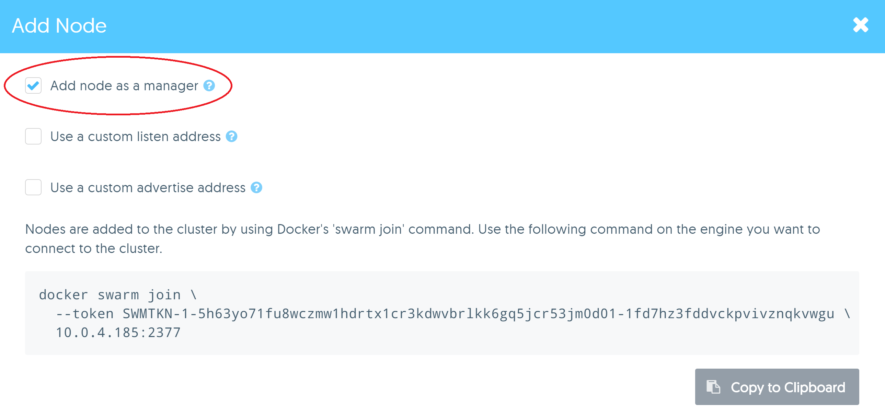
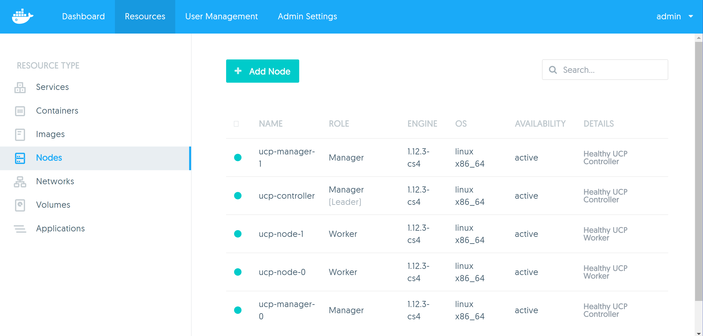
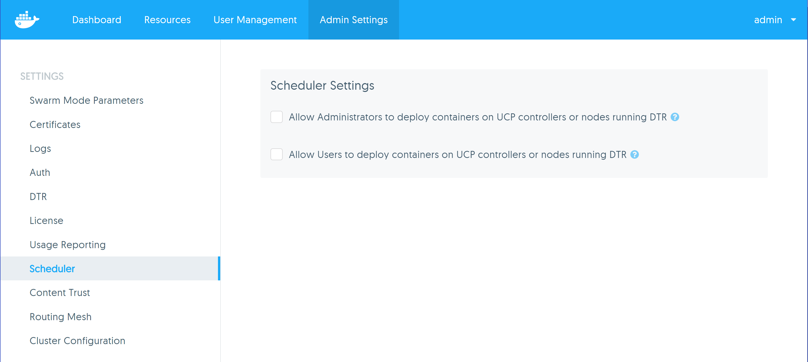

# Task - Add Manager nodes

In this task, we will add 2 additional manager nodes to our UCP installation in order to make it highly available.

## Pre-requisites

1. UCP installed with 2 worker nodes
2. Two additional pre-provisioned VMs with the following names / tags:
   * `ucp-manager-0`
   * `ucp-manager-1`
   
   Each VM must be running Ubuntu 14.04 with Docker CS Engine 1.12 installed.
   

## Step 1 - Add manager nodes

1. Open your browser to the UCP web interface and go to the **Nodes** page under the **Resources** link.

2. Click the **Add Node** button.

3. Tick the checkbox that says **Add node as a manager**. You should notice that the Swarm join token listed at the bottom changes as you tick the box. Joining a node as a 
   manager requires a different join token to workers. 
   
   
   
   Keep this browser window open.
   
4. Open two new terminals and SSH into your `ucp-manager-0` and `ucp-manager-1` VMs 

5. Go back to the browser and copy the full `docker swarm join` command from the **Nodes** page. Then paste the command into your SSH terminals for `ucp-manager-0` and 
   `ucp-manager-1`.  
   
   You should see output similar to the following on your terminal:
   
   ```
	ubuntu@ucp-manager-0:~$ docker swarm join \
	>   --token SWMTKN-1-5h63yo71fu8wczmw1hdrtx1cr3kdwvbrlkk6gq5jcr53jm0d01-1fd7hz3fddvckpvivznqkvwgu \
	>   10.0.4.185:2377
	This node joined a swarm as a manager.
	ubuntu@ucp-manager-0:~$
   
   ```

6. Go back to the **Nodes** page. You should now see 5 nodes, similar to the following:

   
   
   **Note:** It takes a few minutes for a node to be setup as a UCP manager. This is reflected in the **Details** column. At first it will say that the node is being 
   configured and when finished it will say *Healthy UCP Controller*
   
## Step 2- Test manager nodes

1. Open a new browser tab and put in the domain or public IP of either your `ucp-manager-0` or `ucp-manager-1` VM. You should see the UCP login page.

2. Verify that you can login with the **Admin** account


## Step 3 - Configure Scheduler

Now that we have 3 manager nodes setup, we want to make sure that our manager nodes are dedicated for their purpose and that they do not run any containers. 

1. Click on the **Admin Settings** link on the top navigation bar

2. Now click on **Scheduler** on the left navigation.

3. Uncheck both of the checkbox settings on the page as shown below:

   
   
   This will prevent containers from being scheduled on any of our UCP manager nodes. 
   
   

   
   
   