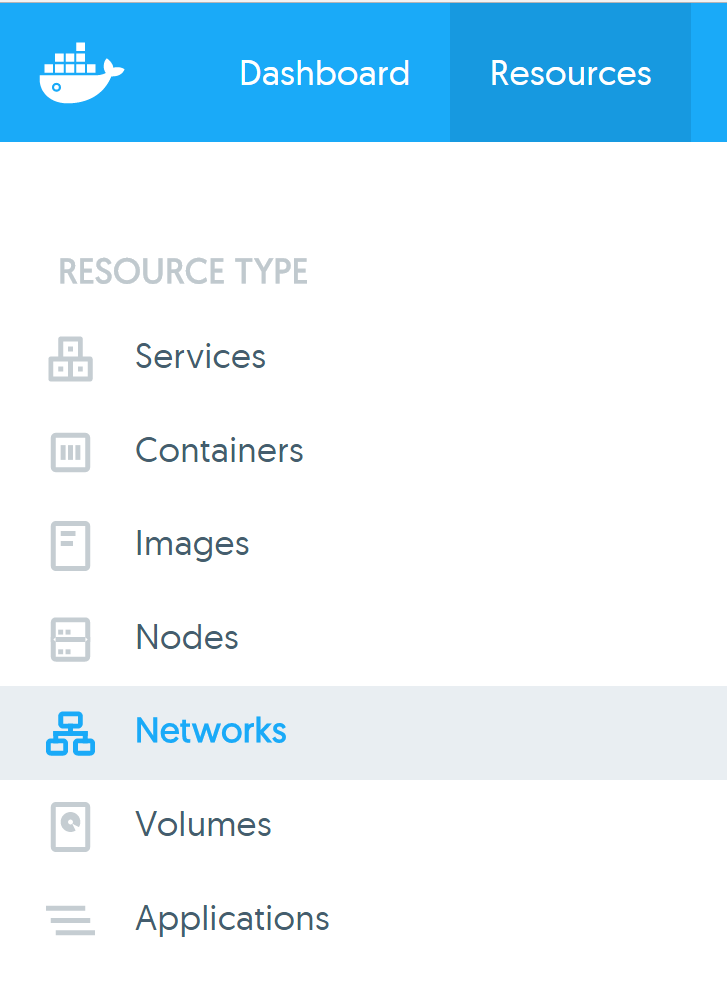
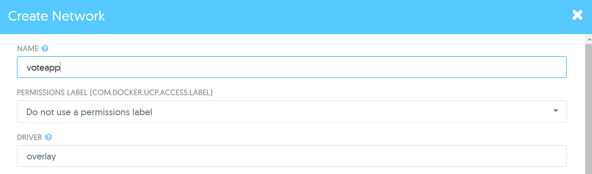
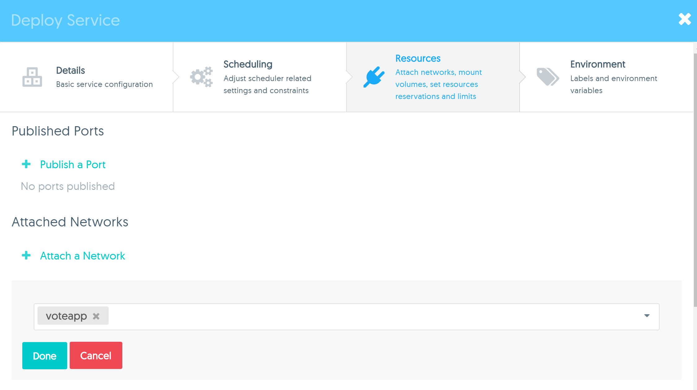
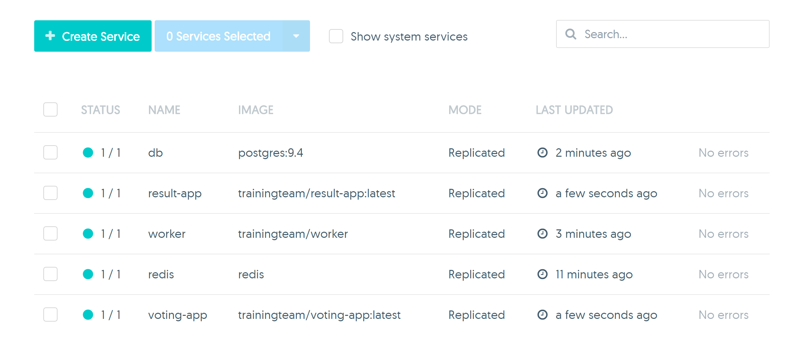
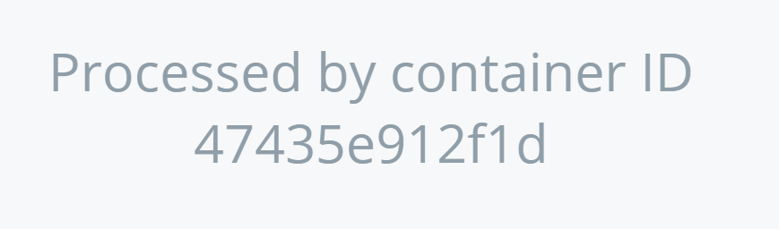

# Task - Deploy an Application

In this task you will learn how to deploy an application that consists of multiple Services.

## Pre-requisites
1. UCP installed with 2 worker nodes
2. No existing services running. Before beginning this exercise, delete all your previous Services that have been deployed. This is so we can free
   up the host ports required.

## Step 1 - Background info

The application that we are going to deploy is a simple Voting app that gives users a choice to vote between two things. The application architecture is explained at 
. 

Your first step is to visit the link above and read the main page to get an understanding of how the application works.

**Note: ** We will not actually be using anything from the GitHub repository above. Instead we will use images that have been created specifically for this exercise.

## Step 2 - Create an overlay network

As you saw from Step 1, the Application consists of five Services:
* A postgres database
* A redis server
* A worker service
* The voting app, where we cast our vote
* The result app to display the result

These services will need to be able to communicate with each, so we will need to run them on the same network.

1. Create an overlay network called **Voteapp**

   a) First, click on the **Networks** link under the **Resources** Tab.
   
   
   
   b) Click the **Create Network** button at the top of the page
   
   c) Specify the following:
   
      * **Name:** Voteapp
	  * **Driver:** overlay
	  
      
	  
   d) Leave all other fields as they are, scroll to the botton and click **Create**
   
   
## Step 3 - Deploy Services

In this step we will deploy the five services that make up our application.

**Note: ** When specifying service names, make sure to specify the exact name as listed in the instructions.

1. First we will deploy the Postgres database service. Create a service using the following details:

   * **Service Name: ** db
   * **Image: ** `postgres:9.4`
   
   a) Attach the service to the **Voteapp** network we created in Step 2.
   
   To attach a service to a network, click on the **Resources** Tab on the create service page. Then on the **Attach a network** link and select the network 
   from the dropdown list. Then click on **Done**
   
   

2. The next service to create is the `redis` service. Create a service with the following details an attach the service to the **Voteapp** network:

   * **Service Name: ** redis
   * **Image: ** redis
   * **Published Ports: ** Port 6379 on the service to port 6379 on the host.
   
3. Create the `worker` service using the following details and attach it to the **Voteapp** network:

   * **Service Name: ** worker
   * **Image: ** trainingteam/worker:latest
   
4. Create the `voting-app` service using the following details and attach it to the **Voteapp** network:

   * **Service Name: ** voting-app`
   * **Image: ** trainingteam/voting-app:latest
   * **Published Ports: ** Port 80 on the service to post 8080 on the host. 

5. Create the `result-app` service using the following details and attach it to the **Voteapp** network:

   * **Service Name: ** result-app`
   * **Image: ** trainingteam/voting-app:latest
   * **Published Ports: ** Port 80 on the service to post 5000 on the host.    
   
At the end of this step, you should have the following Services:

   
   

## Step 4 - Test the Application

1. Open a browser tab and go to your `voting-app` by specifying the URL of any of your UCP nodes, followed by port 8080. You should see the following:

   

2. Open the `results-app` on another browser tab. You can specify the URL of any node in your cluster, followed by port 5000.

   
   
3. Cast your vote and check the update on the results app. 

## Step 5 - Scale the application

Our Voting app is experiencing high volume. Lots of people are trying to vote which is causing a bottleneck in the system. To solve this, we will scale
the `voting-app` service so that we will have more containers to handle the workload.

1. Scale the `voting-app` service to run 3 containers.

2. Open your browser to the voting app and vote a few times. Pay attention to the bottom of the page, where it says **Processed by container ID**.
   Each time you vote, or refresh the page, the container ID changes. This tells us that the request is being served by a different container each time. 
   This is the result of the ingress network load balancing.
   
   

