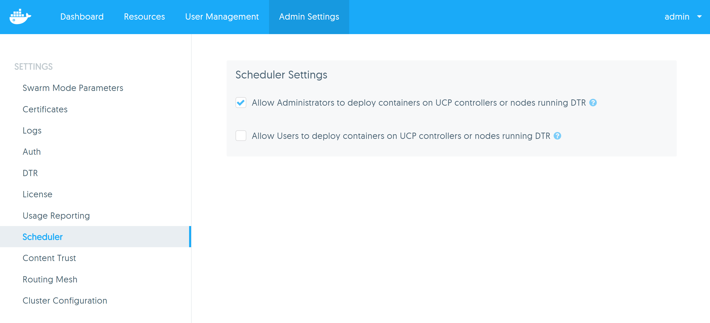
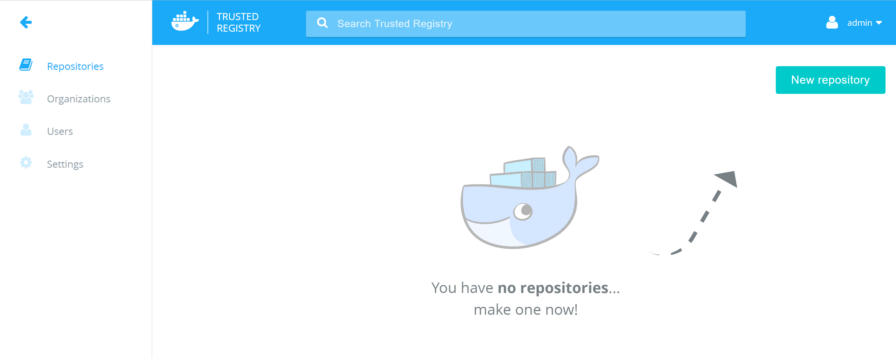
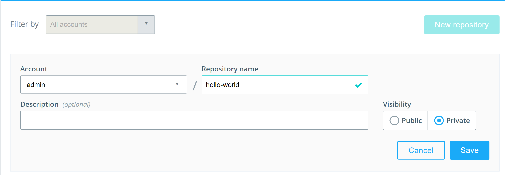

# Task - Install DTR

## Pre-requisites 

1. UCP installed with 2 worker nodes
2. Three additional pre-provisioned VMs with the following names / tags
   * `dtr-replica-0`
   * `dtr-replica-1`
   * `dtr-replica-2`
   

## Step 1 - Add additional worker nodes to UCP 

We are going to setup DTR on our `dtr-replica-0` node to begin with. Eventually we will setup additional replicas of DTR on the `dtr-replica-1` and `dtr-replica-2` VMs.

1. Open a new terminal SSH into the `dtr-replica-0` VM 
2. Join the VM to your UCP installation as a worker node 
3. Repeat the procedure for the `dtr-replica-1` and `dtr-replica-2` VM


## Step 2 - Install DTR

1. Go to the UCP Admin settings in your web browser and look for the **Scheduler** page. 
2. Tick the box that says **Allow Administrators to deploy containers on UCP controllers or nodes running DTR**

   

   We need to enable this in order to be able to install DTR on one of our worker nodes.
   
3. Open a new terminal and SSH into the `ucp-controller` node 
4. Run the following command to install DTR. Pay close attention to the command line prompts when you run this command. 
   `$ docker run -it --rm docker/dtr install --ucp-node dtr-replica-0 --ucp-insecure-tls`
   
   This tells Docker to run the `docker/dtr` image using the install command. The `--ucp-node dtr-replica-0` tells UCP to install it on the node with the name 
   `dtr-replica-0`. The node names are obtained from the **Nodes** page in the UCP web UI.
   
5. The first prompt you will get is for the **dtr-external-url**. This is the URL that users will use to access DTR. You must specify either the public IP or domain of 
   the node you are installing DTR on. In our case this is the `dtr-replica-0` VM.  

	```
	ubuntu@ucp-controller:~$ docker run -it --rm docker/dtr install --ucp-node dtr-replica-0 --ucp-insecure-tls
	INFO[0000] Beginning Docker Trusted Registry installation
	dtr-external-url (URL of the host or load balancer clients use to reach DTR. Format https://host[:port]): https://ec2-54-244-191-106.us-west-2.compute.amazonaws.com
	```
	
6. Specify the URL to UCP along with the UCP admin username and password when prompted. 

   The UCP URL is the URL to the node where you first installed UCP. In our case, this is the `ucp-controller` VM. 

	```
	ucp-url (The UCP URL including domain and port): https://ec2-54-244-0-61.us-west-2.compute.amazonaws.com
	ucp-username (The UCP administrator username): admin
	ucp-password:
	```   
	
The rest of the command line output should be similar to the following:

```
INFO[0027] Validating UCP cert
INFO[0027] Connecting to UCP
INFO[0028] UCP cert validation successful
INFO[0000] Validating UCP cert
INFO[0000] Connecting to UCP
INFO[0000] UCP cert validation successful
INFO[0000] Checking if the node is okay to install on
INFO[0000] Connecting to network: dtr-replica-0/dtr-br
INFO[0000] Waiting for phase2 container to be known to the Docker daemon
INFO[0001] Connecting to network: dtr-ol
INFO[0001] Waiting for phase2 container to be known to the Docker daemon
INFO[0001] Starting UCP connectivity test
INFO[0001] UCP connectivity test passed
INFO[0001] Setting up replica volumes...
INFO[0002] Creating initial CA certificates
INFO[0003] Waiting for etcd...
INFO[0003] Waiting for etcd...
INFO[0004] Waiting for etcd...
INFO[0004] Waiting for etcd...
INFO[0005] Waiting for etcd...
INFO[0009] Generated TLS certificate.                    domain=ec2-54-244-191-106.us-west-2.compute.amazonaws.com
INFO[0011] License config copied from UCP.
INFO[0011] Starting rethinkdb...
INFO[0011] Getting container configuration and starting containers...
INFO[0011] Recreating dtr-rethinkdb-15d25c8e4f1e...
INFO[0013] Waiting for etcd...
INFO[0000] Migrating database schema                     fromVersion=0 toVersion=5
INFO[0002] Determining Number of Nodes in DB Cluster
INFO[0002] Nodes in DB Cluster: 1
INFO[0002] (Re)configuring Database - replicaCount=1
INFO[0002] Creating Database
INFO[0002] (00/08) Configuring Tables...
INFO[0005] (01/08) Configured Table "properties"
INFO[0005] (02/08) Configured Table "client_tokens"
INFO[0005] (03/08) Configured Table "namespace_team_access"
INFO[0005] (04/08) Configured Table "manifests"
INFO[0005] (05/08) Configured Table "repositories"
INFO[0006] (06/08) Configured Table "tags"
INFO[0006] (07/08) Configured Table "events"
INFO[0006] (08/08) Configured Table "repository_team_access"
INFO[0006] Determining Number of Nodes in DB Cluster
INFO[0006] Nodes in DB Cluster: 1
INFO[0006] (Re)configuring Database - replicaCount=1
INFO[0006] Creating Database
INFO[0006] (00/01) Configuring Tables...
INFO[0006] (01/01) Configured Table "tuf_files"
INFO[0006] Determining Number of Nodes in DB Cluster
INFO[0006] Nodes in DB Cluster: 1
INFO[0006] (Re)configuring Database - replicaCount=1
INFO[0006] Creating Database
INFO[0006] (00/01) Configuring Tables...
INFO[0006] (01/01) Configured Table "private_keys"
INFO[0006] Determining Number of Nodes in DB Cluster
INFO[0006] Nodes in DB Cluster: 1
INFO[0006] (Re)configuring Database - replicaCount=1
INFO[0006] Creating Database
INFO[0006] (00/04) Configuring Tables...
INFO[0007] (01/04) Configured Table "action_configs"
INFO[0007] (02/04) Configured Table "crons"
INFO[0007] (03/04) Configured Table "joblogs"
INFO[0008] (04/04) Configured Table "jobs"
INFO[0008] Migrated database from version 0 to 5
INFO[0021] Starting all containers...
INFO[0021] Getting container configuration and starting containers...
INFO[0021] Recreating dtr-etcd-15d25c8e4f1e...
INFO[0025] Recreating dtr-registry-15d25c8e4f1e...
INFO[0026] Recreating dtr-api-15d25c8e4f1e...
INFO[0027] Recreating dtr-notary-server-15d25c8e4f1e...
INFO[0034] Recreating dtr-nginx-15d25c8e4f1e...
INFO[0041] Recreating dtr-jobrunner-15d25c8e4f1e...
INFO[0053] Recreating dtr-notary-signer-15d25c8e4f1e...
INFO[0062] Waiting for etcd...
INFO[0063] Verifying auth settings...
INFO[0063] Waiting for etcd...
INFO[0063] Waiting for DTR to start...
INFO[0064] Authentication test passed.
INFO[0064] Successfully registered dtr with UCP
INFO[0066] Background tag migration started
INFO[0066] Installation is complete
INFO[0066] Replica ID is set to: 15d25c8e4f1e
INFO[0066] You can use flag '--existing-replica-id 15d25c8e4f1e' when joining other replicas to your Docker Trusted Registry Cluster
ubuntu@ucp-controller:~$

```

## Step 3- Check that DTR is running

1. Open your browse to the UCP web UI and click on **Resources** and then **Applications**. You should see DTR listed and when expanded, there should be 8 containers 
   running. 
   
   
   
2. Open a new browser tab and go enter the URL to your DTR installation. 

   Your browser will give you a warning message but this is fine. Just click on proceed anyway. You should see the DTR Dashboard and be logged in as the admin user.
   
   
   

## Step 4 - Integrate UCP and DTR

By default Docker Engine uses TLS when pushing and pulling images to an image registry like Docker Trusted Registry.

If DTR is using the default configurations or was configured to use self-signed certificates, you need to configure your Docker Engine to trust DTR. 
Otherwise, when you try to login or push and pull images to DTR, you'll get an error such as the following:

```
ubuntu@ucp-controller:~$ docker login ec2-54-244-191-106.us-west-2.compute.amazonaws.com
Username: admin
Password:
Error response from daemon: Get https://ec2-54-244-191-106.us-west-2.compute.amazonaws.com/v1/users/: x509: certificate signed by unknown authority
```

The first step to make your Docker Engine trust the certificate authority used by DTR is to get the DTR CA certificate. 
Then you configure your operating system to trust that certificate.

1. Switch into your `ucp-controller` SSH terminal
2. Download the DTR certificate by running the following command:

   `$ sudo curl -k https://<dtr-domain-name>/ca -o /usr/local/share/ca-certificates/<dtr-domain-name>.crt`
   
    ```
	sudo curl -k https://ec2-54-244-191-106.us-west-2.compute.amazonaws.com/ca -o /usr/local/share/ca-certificates/ec2-54-244-191-106.us-west-2.compute.amazonaws.com.crt
	% Total    % Received % Xferd  Average Speed   Time    Time     Time  Current
                                 Dload  Upload   Total   Spent    Left  Speed
	100  2086    0  2086    0     0  46121      0 --:--:-- --:--:-- --:--:-- 46355
	ubuntu@ucp-controller:~$

	```
   
3. Refresh the list of certificates to trust
   
   `$ sudo update-ca-certificates`
   
	```
	ubuntu@ucp-controller:~$ sudo update-ca-certificates
	Updating certificates in /etc/ssl/certs... 1 added, 0 removed; done.
	Running hooks in /etc/ca-certificates/update.d....done.
	```

4. Restart the Docker Engine

   `$ sudo service docker restart`

5. Now login to DTR on the Docker CLI. 
   
   Run `$ docker login <DTR URL>`
   
    ```
	ubuntu@ucp-controller:~$ docker login ec2-54-244-191-106.us-west-2.compute.amazonaws.com
	Username: admin
	Password:
	Login Succeeded
	
	```
   If your login is successful, you have configured your Docker Engine to trust DTR. 
   
6. Repeat steps 2-5 on all your VMs.

   Every Docker Engine in the Swarm cluster must be configured to trust DTR
   

## Step 5 - Test the integration

1. Open your browser to DTR and click on the **New Repository** button to create a repository called `hello-world`. The repository should go under your **admin** account

   
   
2. Open a new SSH terminal to your `ucp-controller` VM

   
   
   
   

   
   

   


   
   

   
