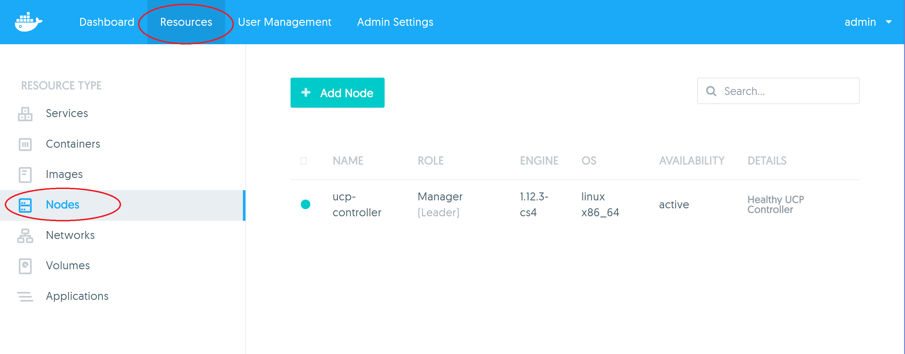
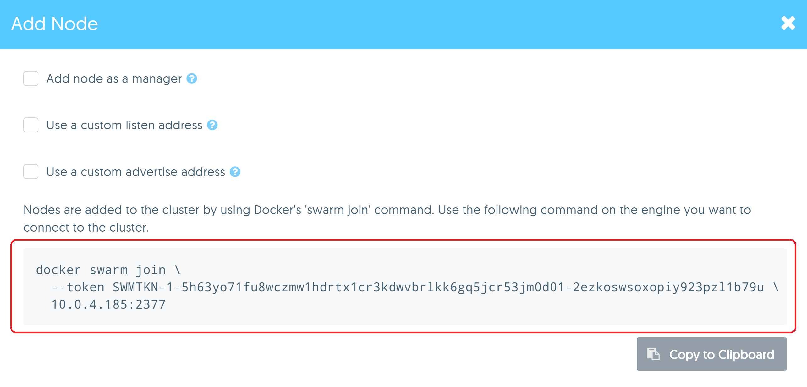
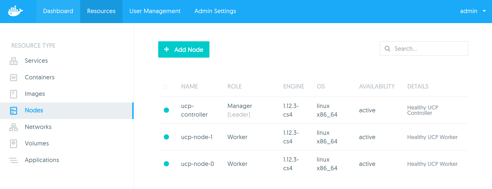

# Task - Install Universal Control Plane

## Pre-requisites
Students should have the following:

1. An understanding of the Linux command line and how to SSH into a cloud based Linux VM
2. An understanding of basic Docker commands
3. A pre provisioned set of VM's in the cloud. There should be 3 VM's with the following names / tags:
   * `ucp-controller`
   * `ucp-node-0`
   * `ucp-node-1`

   Instructors will provide students with their VM details.   
4. Each VM should be pre setup as follows:

   <table>
   <tr>
      <td><b>Operating System</b></td><td>Ubuntu 14.04</td>
   </tr>
   <tr>
      <td><b>Linux kernel</b></td><td>4.2.0-30-generic or later</td>
   </tr>
   <tr> 
      <td><b>Docker Engine version</b></td><td>1.12.30-cs4 or any variant of 1.12 CS Engine</td>
   </tr>
   </table>
   


## Step 1 - Check your environment

1. SSH into your `ucp-controller` VM 
2. Run `docker version` and check the output. You should see the following

   ```
   ubuntu@ucp-controller:~$ docker version
   Client:
    Version:      1.12.3-cs4
    API version:  1.24
    Go version:   go1.6.3
    Git commit:   65c6c4c
    Built:        Fri Nov 11 16:02:12 2016
    OS/Arch:      linux/amd64

   Server:
    Version:      1.12.3-cs4
    API version:  1.24
    Go version:   go1.6.3
    Git commit:   65c6c4c
    Built:        Fri Nov 11 16:02:12 2016
    OS/Arch:      linux/amd64
	
	```
	
	The important thing to check here is that the Docker Engine is 1.12 CS Engine as CS Engine is a requirement for installing UCP. 
	
	If your environment does not have CS Engine installed, please consult with your instructor and also follow the instructions at [https://docs.docker.com/cs-engine/install/#/install-on-ubuntu-1404-lts](https://docs.docker.com/cs-engine/install/#/install-on-ubuntu-1404-lts)
	to install CS Engine. Note, that you will need to remove the existing Docker Engine installation by running `$ sudo apt-get remove docker-engine`
	
3. Repeat this process for all VMs you have been given.


## Step 2 - Install UCP 

In the following steps, pay very close attention to your command line prompts when running these commands.

1. Switch back into your `ucp-controller` VM terminal	

2. Run the following command to install UCP
   `$ docker run --rm -it --name ucp -v /var/run/docker.sock:/var/run/docker.sock docker/ucp install -i`
   
3. Specify the username and password for the default "admin" account when prompted.

   ```
   ubuntu@ucp-controller:~$ docker run --rm -it --name ucp -v /var/run/docker.sock:/var/run/docker.sock docker/ucp install -i
   INFO[0000] Verifying your system is compatible with UCP
   INFO[0000] Your engine version 1.12.3-cs4, build 65c6c4c (4.2.0-30-generic) is compatible
   Admin Username: admin
   Admin Password:
   Confirm Admin Password:
   ```
   
4. You will then be prompted for addtional aliases (SANs). This is an important step and if not done correctly, will lead to certificate x509 errors later on. Here
   we need to specify the public IP address and/or public domain of our `ucp-controller` VM. Depending on your cloud provider, you may or may not have a public domain. 
   In the following example, we are using AWS and all nodes have a public IP and domain. In this example our `ucp-controller` VM's public IP is `54.244.0.61` and the domain is
   `ec2-54-244-0-61.us-west-2.compute.amazonaws.com`. You can separate the both of them with a space.
   
   ```
   INFO[0013] All required images are present
   WARN[0013] None of the hostnames we'll be using in the UCP certificates [ucp-controller 127.0.0.1 172.17.0.1] contain a domain component.  Your generated certs may fail TLS validation unless you only use one of these shortnames or IPs to connect.  You can use the --san flag to add more aliases

   You may enter additional aliases (SANs) now or press enter to proceed with the above list.   
   Additional aliases: ec2-54-244-0-61.us-west-2.compute.amazonaws.com 54.244.0.61
   ```

5. At the end of the command, run `docker ps` and check that the UCP containers are running. You should see the following:

   ```
	ubuntu@ucp-controller:~$ docker ps
	CONTAINER ID        IMAGE                         COMMAND                  CREATED             STATUS              PORTS                                                                             NAMES
	bf3141fc003c        docker/ucp-controller:2.0.1   "/bin/controller serv"   6 minutes ago       Up 6 minutes        0.0.0.0:443->8080/tcp                                                             ucp-controller
	31037f6a14f0        docker/ucp-swarm:2.0.1        "/swarm manage --tlsv"   6 minutes ago       Up 6 minutes        0.0.0.0:2376->2375/tcp                                                            ucp-swarm-manager
	f6aa678f7438        docker/ucp-auth:2.0.1         "/usr/local/bin/enzi "   6 minutes ago       Up 6 minutes        0.0.0.0:12385->4443/tcp                                                           ucp-auth-api
	3e61dd6ccc26        docker/ucp-auth:2.0.1         "/usr/local/bin/enzi "   6 minutes ago       Up 6 minutes        0.0.0.0:12386->4443/tcp                                                           ucp-auth-worker
	2e7ccaf48019        docker/ucp-auth-store:2.0.1   "rethinkdb --bind all"   6 minutes ago       Up 6 minutes        0.0.0.0:12383-12384->12383-12384/tcp                                              ucp-auth-store
	4a96888d85eb        docker/ucp-etcd:2.0.1         "/bin/etcd --data-dir"   6 minutes ago       Up 6 minutes        2380/tcp, 4001/tcp, 7001/tcp, 0.0.0.0:12380->12380/tcp, 0.0.0.0:12379->2379/tcp   ucp-kv
	6842246b46d0        docker/ucp-cfssl:2.0.1        "/bin/ucp-ca serve -a"   6 minutes ago       Up 6 minutes        0.0.0.0:12382->12382/tcp                                                          ucp-client-root-ca
	df11fd810788        docker/ucp-cfssl:2.0.1        "/bin/ucp-ca serve -a"   6 minutes ago       Up 6 minutes        0.0.0.0:12381->12381/tcp                                                          ucp-cluster-root-ca
	d247c7c278be        docker/ucp-agent:2.0.1        "/bin/ucp-agent proxy"   6 minutes ago       Up 6 minutes        0.0.0.0:12376->2376/tcp                                                           ucp-proxy
	0acc8f6fbfe7        docker/ucp-agent:2.0.1        "/bin/ucp-agent agent"   6 minutes ago       Up 6 minutes        2376/tcp                                                                          ucp-agent.0.5w7kq4d6ty7ejx2u26y5yj27i
   ```
   
## Step 3 - License the installation

1. Open you browser and enter the public IP or domain to your `ucp-controller` VM. Make sure to specify HTTPS in the address field. The UCP web console is not accessible 
   over standard HTTP. You should see the login page.
   
   **Note:** Most browsers will display some sort of warming message regardin the connection. This is because we are using the default self signed certificates as opposed
   to a certificate from a trusted source. You can tell the browser to ignore the warning and proceed.
 
2. Login to your Admin account. 

3. Once logged in you will see a prompt screen asking you to upload a license. Click the **Upload License** button and find the license file on your PC.
   
   **Note:** Your instructor will provide you with details on how to obtain a trial license. 
   

## Step 4 - Add additional worker nodes

Now that we have installed UCP, it's time to add additional worker nodes so that we can begin deploying Services and containers on them.

1. Click the **Resources** link on the top navigation bar and then click on **Nodes** on the left navigation panel. You should see a page listing all the nodes in your 
   UCP cluster. At the moment, you should have one node, which is the `ucp-controller`
    
   
   
2. Click on the **Add Node** button on the page.

3. Take note of the `docker swarm join` command that is listed. Keep your browser here for the time being.

   
   
4. Open two new SSH terminals into your `ucp-node-0` and `ucp-node-1` VMs.

5. Switch back to your browser and copy the `docker swarm join` command from the **Add Node** Page.

6. Paste the command into the terminal of your `ucp-node-0` and `ucp-node-1` VM. You should see similar output to the following, on both VM's.

   ```
	ubuntu@ucp-node-0:~$ docker swarm join \
	>   --token SWMTKN-1-5h63yo71fu8wczmw1hdrtx1cr3kdwvbrlkk6gq5jcr53jm0d01-2ezkoswsoxopiy923pzl1b79u \
	>   10.0.4.185:2377
	This node joined a swarm as a worker.
	ubuntu@ucp-node-0:~$
   ```
   
7. Click on the **Nodes** page and check that you have 3 nodes in your cluster.

   
   

## Conclusion

Congratulations, you have now setup a UCP cluster with 3 nodes, one node as a manager and two nodes as workers. 


   
   
 