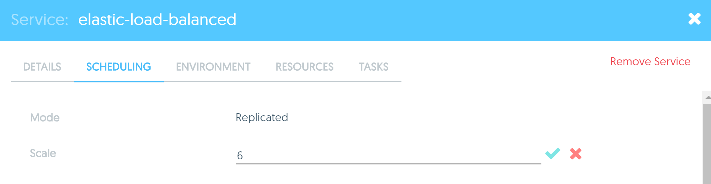
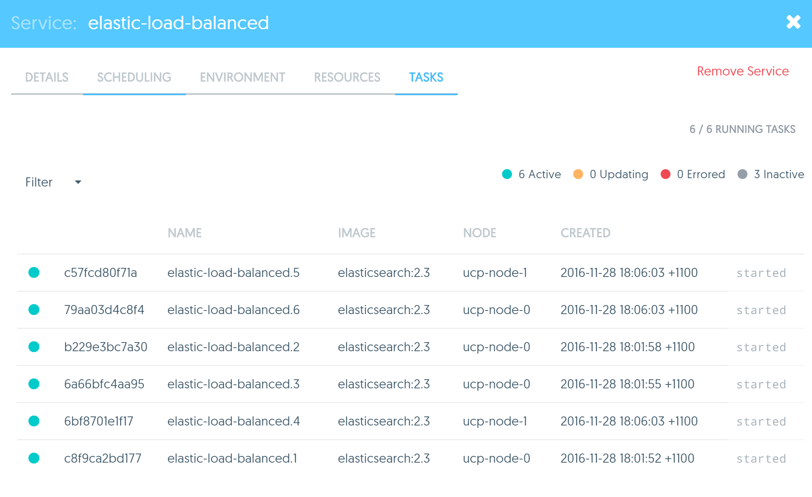

# Task - Ingress Load Balancing 

In this task, you will observe the behaviour of the built in load balancing abilities of the Ingress network

## Pre-requisites
1. UCP installed with 2 worker nodes

## Step 1 - Deploy ElasticSearch service

1. Deploy a Service using the `elasticsearch:2.3` image and specify the following details:
	* **Service Name: ** elastic-load-balanced
	* **Published Ports** - Publish the service port 9200 onto the public port of 9200.  
	* **Mode:** Replicated
	* **Scale:** 3
2. Once the Service is deployed check the **Task** tab to confirm that there are 3 containers running

## Step 2 - Observe load-balancing and Scale

1. SSH into the `ucp-controller` node
2. Run `curl localhost:9200` and observe the output. You should see something similar to the following:
   ```
   ubuntu@ucp-controller:~$ curl localhost:9200
   {
     "name" : "Entropic Man",
     "cluster_name" : "elasticsearch",
     "version" : {
       "number" : "2.3.5",
       "build_hash" : "90f439ff60a3c0f497f91663701e64ccd01edbb4",
       "build_timestamp" : "2016-07-27T10:36:52Z",
       "build_snapshot" : false,
       "lucene_version" : "5.5.0"
     },
     "tagline" : "You Know, for Search"
   }
   ```
3. Take note of the value of the **name** attribute. In this example, our **name** is `Entropic Man`. ElasticSearch instances use a unique name to identify themselves. So 
   each one of our ElasticSearch container should have a different name. 
   
4. Run `curl localhost:9200` again. What can you observe? In our example we have the following:
   ```
   ubuntu@ucp-controller:~$ curl localhost:9200
   {
     "name" : "Horus",
     "cluster_name" : "elasticsearch",
     "version" : {
       "number" : "2.3.5",
       "build_hash" : "90f439ff60a3c0f497f91663701e64ccd01edbb4",
       "build_timestamp" : "2016-07-27T10:36:52Z",
       "build_snapshot" : false,
       "lucene_version" : "5.5.0"
     },
     "tagline" : "You Know, for Search"
   }
   ```
5. Notice how everything was the same, except the **name**. This shows us that the UCP routing mesh has sent our 2nd request over to a different container, since the **name** was different. 

6. Repeat the command two more times. What can you observe?

   ```
   ubuntu@ucp-controller:~$ curl localhost:9200
   {
     "name" : "Horus",
     "cluster_name" : "elasticsearch",
     "version" : {
       "number" : "2.3.5",
       "build_hash" : "90f439ff60a3c0f497f91663701e64ccd01edbb4",
       "build_timestamp" : "2016-07-27T10:36:52Z",
       "build_snapshot" : false,
       "lucene_version" : "5.5.0"
     },
     "tagline" : "You Know, for Search"
   }
   ubuntu@ucp-controller:~$ curl localhost:9200
   {
     "name" : "Entropic Man",
     "cluster_name" : "elasticsearch",
     "version" : {
       "number" : "2.3.5",
       "build_hash" : "90f439ff60a3c0f497f91663701e64ccd01edbb4",
       "build_timestamp" : "2016-07-27T10:36:52Z",
       "build_snapshot" : false,
       "lucene_version" : "5.5.0"
     },
     "tagline" : "You Know, for Search"
   }
   ```

   You should see one new name and then on the 4th request it should revert back to the name of the first container. In this example that name is `Entropic Man`
   
7. Now let's scale the number of Tasks for our `elastic-load-balanced` service. We will add 3 more Tasks to the service so that we have a total of six ElasticSearch containers. 

   a) First, click on **Resources** and go to the **Services** page. 
   
   b) Then click on the `elastic-load-balanced` service that we've created. 
   
   c) Click on the **Scheduling** Tab in the service details and edit the **Scale** field to 6 as shown below:
   
   
   
   d) Once you have edited the field, click on the **Tick** symbal and then click **Save Changes** on the top right.
   
8. Now click on the **Tasks** Tab of the elastic service and verify that there are 6 tasks running

   
   
9. Now switch back to you SSH terminal and run `curl localhost:9200` multiple times again. You should be able to observe some new names.


## Step 3 - Ingress Routing Mesh

Remember the `Nginx_service` we deployed in the previous Task? Try and hit the NGINX server on any node in your cluster. 

1. Open a browser tab and specify the public domain or IP address, followed by port 8080 of any of your UCP nodes. Try at least the following nodes:
   * `ucp-controller`
   * `ucp-node-0`
   * `ucp-node-1`
   * `ucp-managers-0`
   * `ucp-managers-1`

2. You should be able to observe the NGINX welcome page on all of them, even though we are only running one NGINX container.   


   