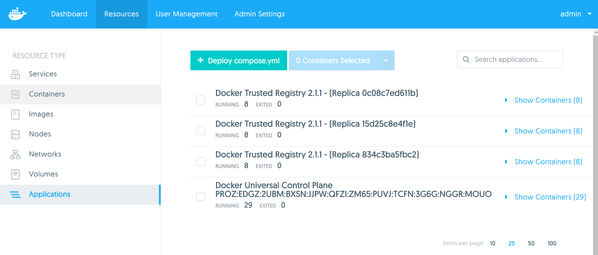

# Task - Install DTR Replicas

In this task, you will setup 2 additional DTR replicas in order to implement high availability.

## Pre-requisites 

1. UCP installed with 2 worker nodes
2. DTR installed and integrated with UCP 
3. The VM's listed below joined into UCP as worker nodes 
   * `dtr-replica-1`
   * `dtr-replica-2`
   
## Step 1 - Install Replicas

1. SSH into your `ucp-controller` VM
2. Run the following command to install a replica.

   `$ docker run -it --rm docker/dtr join --ucp-node dtr-replica-1 --ucp-insecure-tls`
   
   This command will instruct the replica to be installed on the node with the name `dtr-replica-1`
   
   Specify your UCP URL, username and password when prompted.
   
    ```
	ubuntu@ucp-controller:~$ docker run -it --rm docker/dtr join --ucp-node dtr-replica-1 --ucp-insecure-tls
	INFO[0000] Beginning Docker Trusted Registry replica join
	ucp-url (The UCP URL including domain and port): https://ec2-54-244-0-61.us-west-2.compute.amazonaws.com
	ucp-username (The UCP administrator username): admin
	ucp-password:
	INFO[0012] Validating UCP cert
	INFO[0012] Connecting to UCP
	INFO[0012] UCP cert validation successful
	```
	
3. Specify the DTR replica ID of the DTR replica you want to join to. At this stage, there is only 1 ID value listed. Simply copy the ID value displayed
   on your terminal and paste it on the next line. This ID is the instance ID of your existing DTR installation.

   ```
   INFO[0012] This cluster contains the replicas: 15d25c8e4f1e
   Choose a replica to join to [15d25c8e4f1e]: 15d25c8e4f1e
   ```
   
   Your remaining command line output should be similar to the following:
   
    ```
	INFO[0000] Validating UCP cert
	INFO[0000] Connecting to UCP
	INFO[0000] UCP cert validation successful
	INFO[0003] Validating UCP cert
	INFO[0003] Connecting to UCP
	INFO[0003] UCP cert validation successful
	INFO[0003] Checking if the node is okay to install on
	INFO[0004] Cleaning up before overlay network test
	INFO[0004] Starting overlay network test
	INFO[0012] Overlay networking test passed.
	INFO[0012] Creating network: dtr-replica-1/dtr-br
	INFO[0012] Connecting to network: dtr-replica-1/dtr-br
	INFO[0012] Waiting for phase2 container to be known to the Docker daemon
	INFO[0013] Connecting to network: dtr-ol
	INFO[0013] Waiting for phase2 container to be known to the Docker daemon
	INFO[0013] Starting UCP connectivity test
	INFO[0013] UCP connectivity test passed
	INFO[0013] Setting up replica volumes...
	INFO[0014] Connecting to etcd...
	INFO[0014] Connecting to etcd...
	INFO[0014] Connecting to etcd...
	INFO[0021] Waiting for etcd...
	INFO[0021] Getting container configuration and starting containers...
	INFO[0026] Recreating dtr-etcd-0c08c7ed611b...
	INFO[0030] Recreating dtr-rethinkdb-0c08c7ed611b...
	INFO[0044] Recreating dtr-registry-0c08c7ed611b...
	INFO[0051] Recreating dtr-api-0c08c7ed611b...
	INFO[0062] Recreating dtr-notary-server-0c08c7ed611b...
	INFO[0067] Recreating dtr-nginx-0c08c7ed611b...
	INFO[0073] Recreating dtr-jobrunner-0c08c7ed611b...
	INFO[0084] Recreating dtr-notary-signer-0c08c7ed611b...
	INFO[0090] Waiting for etcd...
	INFO[0091] Verifying auth settings...
	INFO[0091] Waiting for etcd...
	INFO[0091] Waiting for DTR to start...
	INFO[0092] Authentication test passed.
	INFO[0092] Successfully registered dtr with UCP
	INFO[0093] Updating replication settings...
	INFO[0000] (Re)configuring Database - replicaCount=2
	INFO[0000] Creating Database
	INFO[0000] (00/08) Configuring Tables...
	INFO[0002] (01/08) Configured Table "properties"
	INFO[0002] (02/08) Configured Table "manifests"
	INFO[0002] (03/08) Configured Table "client_tokens"
	INFO[0002] (04/08) Configured Table "namespace_team_access"
	INFO[0002] (05/08) Configured Table "repositories"
	INFO[0002] (06/08) Configured Table "tags"
	INFO[0002] (07/08) Configured Table "events"
	INFO[0002] (08/08) Configured Table "repository_team_access"
	INFO[0002] (Re)configuring Database - replicaCount=2
	INFO[0002] Creating Database
	INFO[0002] (00/01) Configuring Tables...
	INFO[0003] (01/01) Configured Table "tuf_files"
	INFO[0003] (Re)configuring Database - replicaCount=2
	INFO[0003] Creating Database
	INFO[0003] (00/01) Configuring Tables...
	INFO[0004] (01/01) Configured Table "private_keys"
	INFO[0004] (Re)configuring Database - replicaCount=2
	INFO[0004] Creating Database
	INFO[0004] (00/04) Configuring Tables...
	INFO[0005] (01/04) Configured Table "action_configs"
	INFO[0005] (02/04) Configured Table "crons"
	INFO[0005] (03/04) Configured Table "joblogs"
	INFO[0005] (04/04) Configured Table "jobs"
	WARN[0099] Warning! You are using DTR with the filesystem driver in an HA setup. This will not work with non-clustered file systems. See the documentation for how to configure HA image storage.
	INFO[0099] Join is complete
	INFO[0099] Replica ID is set to: 0c08c7ed611b
	INFO[0099] There are currently 2 replicas in your Docker Trusted Registry cluster
	INFO[0099] You currently have an even number of replicas which can impact cluster availability
	INFO[0099] It is recommended that you have 3, 5 or 7 replicas in your cluster
	ubuntu@ucp-controller:~$
	```

4. Run the command again but this time, specify to install the third replica on the `dtr-replica-2` node. 	
	
5. Check the **Applications** page inside the UCP web UI. You should now see three instances of DTR. 

   
   
   
## Step 2 - Verify Replicas

1. Open your web browser and specify the URL or IP address to your `dtr-replica-1` VM. Verify that you can see the DTR dashboard.

2. Repeat step 1 but specify the `dtr-replica-2` VM URL instead. 


## Step 3 - Cleanup

1. Navigate to the **Admin Settings --> Scheduler ** page in UCP

2. Untick both checkbox that says "**Allow Administrators to deploy containers on UCP controllers or nodes running DTR**"

   This is so that later on, when we run containers, we do not accidentally get them scheduled on our DTR nodes or on our UCP manager nodes.
   
   
   