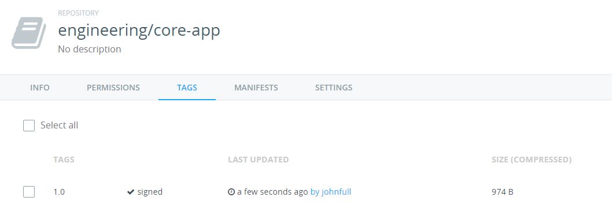

# Task 3 - Enabling Image Signing

In this task you will complete the following steps:
1. Install the Notary CLI
2. Configure the Notary CLI
3. Enable Content Trust for a repository
4. Push a signed image

## Pre-requisites
- DTR installed and integrated with UCP
- All Docker Engines configured to trust DTR certificate. 
- Docker Toolbox OR Docker for Mac / Windows installed on local machine
- Must have completed all user management exercises in order to have the necessary user accounts setup in DTR


In this step, you will pretend to be a development manager in the **engineering** team. You will assume the role of **John**, who was recently made an admin in the 
**engineering** team. As an organization admin, John is also a repository admin and has the responsibility of setting up and delegating image signing on the repositories in 
the team.

**Note:** Unless otherwise indicated, you should use the VM marked as **eng-local**

## Step 1 - Install the Notary CLI

1. Open your web browser and go to [https://github.com/docker/notary/releases](https://github.com/docker/notary/releases). Look for the **Downloads** section of the latest release on the page:

   

2. Right click on the **notary-linux-amd64** link and copy the link location
3. SSH into the **eng-local** VM. 
4. Run `wget` and paste in the link location.

   `$ wget https://github.com/docker/notary/releases/download/v0.4.2/notary-Linux-amd64`
   
5. Copy the downloaded binary file into the `/usr/local/bin` folder and rename it to just `notary`

   `$ sudo cp notary-Linux-amd64 /usr/local/bin/notary`
   
6. Set the permissions on the `notary` client

   `$ sudo chmod +x /usr/local/bin/notary`   


## Step 2 - Configure the Notary CLI

In order for the Notary CLI to talk to the Notary server, we must specify where our server is with the `-s` option. For example:
`$ notary -s https://<dtr url> -d ~/.docker/trust <command> ...`

The `-d` option tells the Notary CLI where to store private keys and cache data. 

However, having to specify `-s` and `-d` everytime we want to run a `notary` command is very tedious. A better option is to setup an alias in your `.bashrc` profile. 

If your Docker Trusted Registry is not using certificates signed by a globally trusted certificate authority, you’ll also need to configure notary to use the certificate of the DTR CA:

1. Get a copy of the DTR CA certificate

   The easiest way to do this is to open your web browser and go to [https://your_DTR_URL/ca](https://<dtr url>/ca). Copy the contents of the page.

2. In your command line terminal, create a file in your home directory called `dtr-ca.pem`. Paste in the contents you copied in Step 1.

3. Open your `.bashrc` file in a text editor.

   `$ vim ~/.bashrc`

4. Scroll to the end of the file and add the following line:

   ```
   alias notary="notary -s https://YOUR_DTR_URL -d ~/.docker/trust --tlscacert /home/ubuntu/dtr-ca.pem"
   ```
   
5. Re-run your `.bashrc` file in order for the new alias to take effect.

   `$ source .bashrc` 
   

## Step 3 - Setup Content Trust for a repository

1. Check if Notary has content trust data for our `engineering/core-app` repository by running :

   `$ notary list <DTR URL>/engineering/core-app`
   
   When prompted for a username and password, enter John's credentials.
   
   ```
   ubuntu@notary-client:~$ notary list ec2-54-213-179-82.us-west-2.compute.amazonaws.com/engineering/core-app
   Enter username: johnfull
   Enter password:

   * fatal: ec2-54-213-179-82.us-west-2.compute.amazonaws.com does not have trust data for ec2-54-213-179-82.us-west-2.compute.amazonaws.com/engineering/core-app
   ```
   
   Notice the error message since we do not have any trust data at the moment.
   
2. Initialise the Content trust collection by running:

   `$ notary init -p <DTR URL>/engineering/core-app`
   
   You will be prompted to pick as passphrase for a **root key, targets key** and **snapshot key**. To keep things simple in this exercise, you can just use the same 
   passphrase for all 3 keys. Make sure you remember it.

   ```
   ubuntu@notary-client:~$ notary init -p ec2-54-213-179-82.us-west-2.compute.amazonaws.com/engineering/core-app
   No root keys found. Generating a new root key...
   You are about to create a new root signing key passphrase. This passphrase
   will be used to protect the most sensitive key in your signing system. Please
   choose a long, complex passphrase and be careful to keep the password and the
   key file itself secure and backed up. It is highly recommended that you use a
   password manager to generate the passphrase and keep it safe. There will be no
   way to recover this key. You can find the key in your config directory.
   Enter passphrase for new root key with ID ae433e3:
   Repeat passphrase for new root key with ID ae433e3:
   Enter passphrase for new targets key with ID aba7206 (ec2-54-213-179-82.us-west-2.compute.amazonaws.com/engineering/core-app):
   Repeat passphrase for new targets key with ID aba7206 (ec2-54-213-179-82.us-west-2.compute.amazonaws.com/engineering/core-app):
   Enter passphrase for new snapshot key with ID e195baf (ec2-54-213-179-82.us-west-2.compute.amazonaws.com/engineering/core-app):
   Repeat passphrase for new snapshot key with ID e195baf (ec2-54-213-179-82.us-west-2.compute.amazonaws.com/engineering/core-app):
   Enter username: johnfull
   Enter password:
   Auto-publishing changes to ec2-54-213-179-82.us-west-2.compute.amazonaws.com/engineering/core-app
   Enter username: johnfull
   Enter password:
   Successfully published changes for repository ec2-54-213-179-82.us-west-2.compute.amazonaws.com/engineering/core-ap
   ``` 
   
   
## Step 4 - Push a signed image   
   
1. Pull the `hello-world` image into your **eng-local** VM

2. Tag the image with your DTR core-app repo

   `$ docker tag hello-world <DTR URL>/engineering/core-app`
   
3. Enable content trust by running:

   `$ export DOCKER_CONTENT_TRUST=1`
   
4. Login to DTR on the Docker CLI as user `johnfull`

5. Push the <DTR URL>/engineering/core-app image. 

   ```
   ubuntu@notary-client:~$ docker push ec2-54-213-179-82.us-west-2.compute.amazonaws.com/engineering/core-app:1.0
   The push refers to a repository [ec2-54-213-179-82.us-west-2.compute.amazonaws.com/engineering/core-app]
   a02596fdd012: Layer already exists
   1.0: digest: sha256:a18ed77532f6d6781500db650194e0f9396ba5f05f8b50d4046b294ae5f83aa4 size: 524
   Signing and pushing trust metadata
   Enter passphrase for repository key with ID aba7206 (ec2-54-213-179-82.us-west-2.compute.amazonaws.com/engineering/core-app):
   Successfully signed "ec2-54-213-179-82.us-west-2.compute.amazonaws.com/engineering/core-app":1.0
   ```

6. Go to the `engineering/core-app repository on your web browser and click on the **Tags** tab. You should be able to see the 1.0 image you pushed. It should be 
   marked as signed.

      
   

