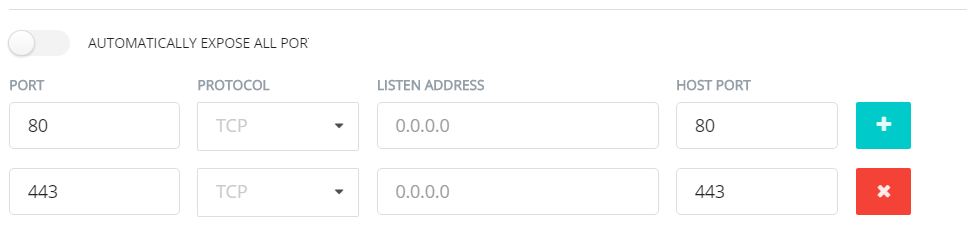
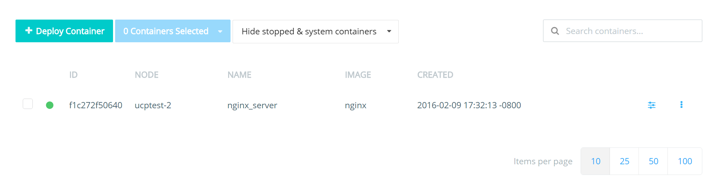
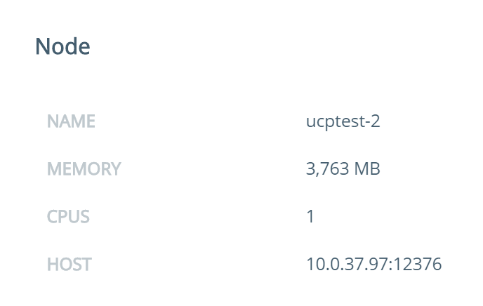

# Task 2: Deploy a container

## Prerequisites
UCP setup with 3 nodes connected to the UCP controller

## Deploy a container
In this exercise we will deploy an NGINX container

1. Click on **Containers** link on left navigation bar
2. Click on **Deploy Container** button
3. On the Basic settings section fill in the following details:
4. **Image Name:** nginx  
   **Container Name:** nginx_server
5. Click on the **Network** section to expand it and configure the following port mappings:  

  

6. Hit the **Run Container** button on the right side panel
7. You should now see your container listed.   

  
8. Click on the row where the container is listed to see the full container details. Then scroll down to the **Ports** section of the page to check the port mappings  

  

## Quick Test

Access the NGINX server on your web browser. You will need to specify the hostname of the node that the NGINX container is running on.

1. First, let's take a look at the node our `nginx_server` container is running on. In the container details, you can find the Node information.

   

   In this particular example, our NGINX container is running on the **ucp-node-1** node. The host IP is 10.0.28.145. However in our AWS setup, this 
   is the private IP address of the node. You won't be able to use this address on your web browser. We will need the public IP or hostname. The AWS instance 
   details that your instructor has provided to you should contain the hostname. In our case it is **ec2-54-213-151-242.us-west-2.compute.amazonaws.com**. 

2. Go to your web browser and enter the hostname of the node that the NGINX container is running on.

   The result should be the NGINX welcome page.
   
   