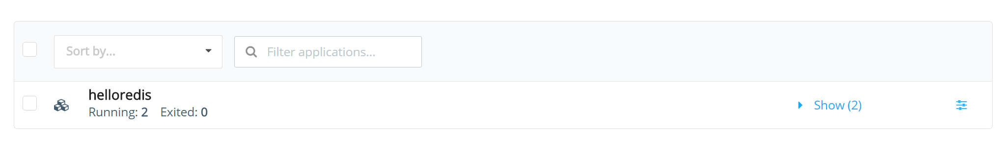
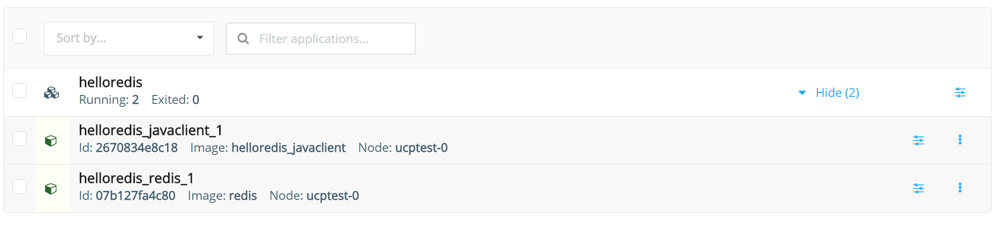

# Task 4 - Deploy a simple application on UCP

## Deploy an application using Docker Compose

In this exercise we will deploy a simple multi container application. The application will be run using **Docker Compose** and contains 2 services (containers)
- A Redis Container
- A Java client that pings the container to get a response


1. SSH into your UCP controller AWS machine
2. Use Git to clone the application repository from https://github.com/johnny-tu/HelloRedis.git 

   ```bash
   ubuntu@ucptest-0:~$ git clone https://github.com/johnny-tu/HelloRedis.git
   Cloning into 'HelloRedis'...
   remote: Counting objects: 42, done.
   remote: Total 42 (delta 0), reused 0 (delta 0), pack-reused 42
   Unpacking objects: 100% (42/42), done.
   Checking connectivity... done.
   ```
3. You should now see a folder called `HelloRedis`. Change directory into this folder
4. List the files in the directory. You should see a `docker-compose.yml` file

   ```bash
   ubuntu@ucptest-0:~/HelloRedis$ ls
   docker-compose.yml  Dockerfile  lib  README.md  src
   ```
   
5. Run `docker-compose up -d`

   ```bash
   ubuntu@ucptest-0:~/HelloRedis$ docker-compose up -d
   Pulling redis (redis:latest)...
   ....
   ....
   58e12b50fee8: Already exists
   a1a961e320bc: Already exists
   Digest: sha256:de86bd14ab69c9b707fe5f3213f6e3c6f543df28bc05ae6cef7b61f2b12be343
   Status: Downloaded newer image for redis:latest
   Creating helloredis_redis_1
   Building javaclient
   Step 1 : FROM java:7
    ---> fa92e621c863
   Step 2 : COPY /src /HelloRedis/src
    ---> 3c03510b7d63
   Removing intermediate container 0677d35671e7
   Step 3 : COPY /lib /HelloRedis/lib
    ---> e8a3e4b97232
   Removing intermediate container d57cc413f15d
   Step 4 : WORKDIR /HelloRedis
    ---> Running in 6d0dc774f3b8
    ---> 4e7f89946fbf
   Removing intermediate container 6d0dc774f3b8
   Step 5 : RUN javac -cp lib/jedis-2.1.0-sources.jar -d . src/HelloRedis.java
    ---> Running in 3f864a7e7060
    ---> b12b150e9564
   Removing intermediate container 3f864a7e7060
   Step 6 : CMD java HelloRedis
    ---> Running in a4206d4b6f70
    ---> ed3870e00457
   Removing intermediate container a4206d4b6f70
   Successfully built ed3870e00457
   Creating helloredis_javaclient_1
   ubuntu@ucptest-0:~/HelloRedis$
   ```
   
6. Now run `docker-compose ps`. What can you observe?

   ```bash
   ubuntu@ucptest-0:~/HelloRedis$ docker-compose ps
            Name                       Command             State    Ports
   ------------------------------------------------------------------------
   helloredis_javaclient_1   java HelloRedis               Up
   helloredis_redis_1        /entrypoint.sh redis-server   Up      6379/tcp
   ```

7. Switch over to UCP on your web browser
8. Click on the “Applications” link on the left navigation bar
9. You should see the following output

   

10. Click on the “Show” link on the right side to expand the view of the application

   
   
   You will notice that when we expand the the view of the `helloredis` application, we also see each service that the application is composed of. 

## Using the Client Bundle

Manually logging into the EC2 instance to run docker-compose to deploy your applications is not very convenient and in a lot of cases not possible. 
After all, you wouldn’t want to give SSH access to too many people. So instead of SSHing into the machine in order to deploy our applications, 
we use the client bundle.

The client bundle sets up the certificates needed in order to allow us to use a Docker client or docker-compose on our local machine. 
It will connect our Docker client to the Swarm manager that is running on our UCP controller node. 

1. Navigate to your user profile in UCP

   
2. Click the “Create a Client Bundle” button. This will download a “zip” file with the necessary keys, 
   certificates and scripts needed to connect your Docker client to Swarm. 
   
   
3. Unzip the Client Bundle to a folder of your choice
4. Take note of the files in your folder now. You should see an `env.sh` file

   Note that in this example we are using a Windows machine and we have unzipped the bundle to `C:\Docker\ucp_client_bundles\ucp-bundle-admin`. 
   Let's examine the directory using the Windows Terminal (CMD)
   
   ```
      C:\Docker\ucp_client_bundles\ucp-bundle-admin>dir
	  Volume in drive C is OS
	  Volume Serial Number is 10D0-EAA3

	  Directory of C:\Docker\ucp_client_bundles\ucp-bundle-admin

	  16/02/2016  01:55 PM    <DIR>          .
	  16/02/2016  01:55 PM    <DIR>          ..
	  16/02/2016  01:55 PM             3,648 ca.pem
	  16/02/2016  01:55 PM             1,679 cert.pem
	  16/02/2016  01:55 PM               450 cert.pub
	  16/02/2016  01:55 PM               588 env.cmd
	  16/02/2016  01:55 PM               627 env.ps1
	  16/02/2016  01:55 PM               572 env.sh
	  16/02/2016  01:55 PM             1,679 key.pem
               7 File(s)          9,243 bytes
               2 Dir(s)  626,723,794,944 bytes free
			  
	```
   
   Note the certificates and the `env.sh` and `env.cmd` files. For users on Mac OSX or Linux, you will be using the `env.sh` file. Windows users using
   `CMD` terminal will be using `env.cmd`

5. Open `env.sh` and take note of the environment variables that the script is setting
   Let's take a look at `env.sh`
   ```
   export DOCKER_TLS_VERIFY=1
   export DOCKER_CERT_PATH=$(pwd)
   export DOCKER_HOST=tcp://54.213.232.221:443
   ```
   
   The `DOCKER_TLS_VERIFY` variable turns on TLS verification between our Docker Client and the Docker Engine we want to communicate with.  
   The `DOCKER_CERT_PATH` variable specifies where our SSL certificates and private key is located. In this case it is in the same folder as our `env.sh` script.  
   The `DOCKER_HOST` variable specifies the address of the Host we are connecting the client to. In this case, it is our Swarm Manager running on the UCP
   controller node. 
   
   Note that in our example the `DOCKER_HOST` is specified with the public IP address of the node. It would also be possible to specify it with the DNS Name
6. Open your terminal and change directory into the folder where you extracted the client bundle zip
7. Run `source ./env.sh` or `env.cmd`

   **For Mac and Linux users**  
   `$ source ./env.sh`  
   To verify that it worked, check the value of the variables
   ```
   $ echo $DOCKER_HOST
   tcp://54.213.232.221:443
   ```
   
   **For Windows users using CMD Terminal**  
   ```
   C:\Docker\ucp_client_bundles\ucp-bundle-admin>env.cmd

   C:\Docker\ucp_client_bundles\ucp-bundle-admin>echo %DOCKER_HOST%
   tcp://54.213.232.221:443
   ```
   **Note:** Windows users can opt to use a command line tool such as `git bash` and thus be able to follow the same instructions as Mac and Linux users.
8. Now run `docker info`. You should be able to see all nodes that are connected   

   ```
   C:\Docker\ucp_client_bundles\ucp-bundle-admin>docker info
   Containers: 26
   Images: 61
   Role: primary
   Strategy: spread
   Filters: health, port, dependency, affinity, constraint
   Nodes: 3
    ucptest-0: 10.0.7.71:12376
      Status: Healthy
      Containers: 9
      Reserved CPUs: 0 / 1
      Reserved Memory: 0 B / 3.859 GiB
      Labels: executiondriver=native-0.2, kernelversion=4.2.0-23-generic, operatingsystem=Ubuntu 14.04.3 LTS, storagedriver=aufs
      Error: (none)
      UpdatedAt: 2016-02-16T23:48:03Z
    ucptest-1: 10.0.31.249:12376
      Status: Healthy
      Containers: 9
      Reserved CPUs: 0 / 1
      Reserved Memory: 0 B / 3.859 GiB
      Labels: executiondriver=native-0.2, kernelversion=4.2.0-23-generic, operatingsystem=Ubuntu 14.04.3 LTS, storagedriver=aufs
      Error: (none)
      UpdatedAt: 2016-02-16T23:48:05Z
    ucptest-2: 10.0.37.97:12376
      Status: Healthy
      Containers: 8
      Reserved CPUs: 0 / 1
      Reserved Memory: 0 B / 3.859 GiB
      Labels: executiondriver=native-0.2, kernelversion=4.2.0-23-generic, operatingsystem=Ubuntu 14.04.3 LTS, storagedriver=aufs
      Error: (none)
      UpdatedAt: 2016-02-16T23:47:35Z
   Cluster Managers: 1
    10.0.7.71: Healthy
      Orca Controller: https://10.0.7.71:443
      Swarm Manager: tcp://10.0.7.71:2376
      KV: etcd://10.0.7.71:12379
   CPUs: 3
   Total Memory: 11.58 GiB
   Name: ucp-controller-ucptest-0
   ID: XNC3:3FYO:DFE3:MLZ5:IUOT:67IV:4RQU:PTJV:S7H7:YL3Y:DQB7:SZGD
   Labels:
    com.docker.ucp.license_key=unlicensed
    com.docker.ucp.license_max_engines=0
    com.docker.ucp.license_expires=EXPIRED

   C:\Docker\ucp_client_bundles\ucp-bundle-admin>
   ```
9. Clone the HelloRedis repository https://github.com/johnny-tu/HelloRedis.git into another folder of your choice
10. Launch the application by using the Client Bundle. To do this, you just need to go into the applications folder and run `docker-compose up -d`

 
## Deploy another application   

For the following section, use what you have learnt just now and complete the steps listed below.
   
1. Now that you’ve deployed your first application, it’s time to try another example. Go to https://github.com/prakhar1989/FoodTrucks
2. Clone the `FoodTrucks` repo into your **UCP Controller** AWS instance
3. Deploy the `FoodTrucks` application into UCP
4. View the application in your web browser

   If you completed all the steps correctly, you should see a very cool application that allows you to search for food trucks in San Francisco
   
   


   

