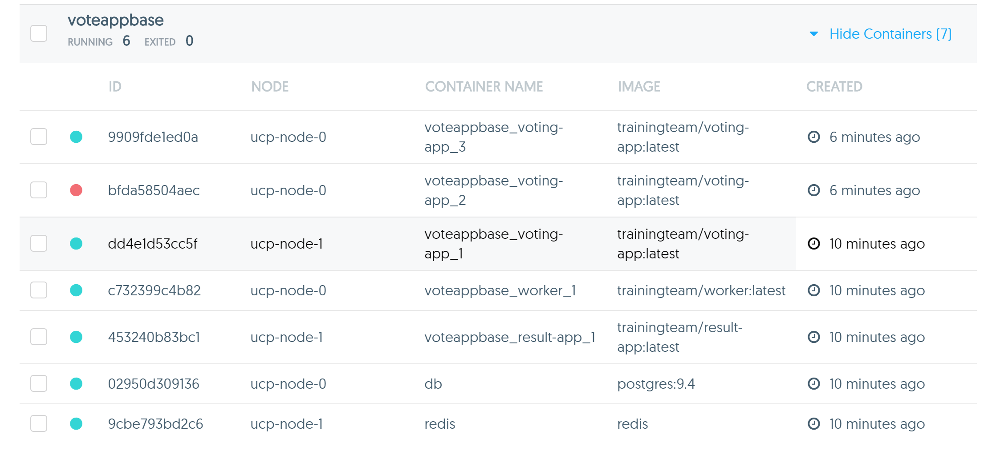

# Task 6 - Deploy Application across multiple nodes

## Pre-requisites
- UCP installed with at least 2 worker nodes
- Client bundle downloaded 

## Step 1 - Download and examine the Voting Application

1. Go to https://github.com/docker/swarm-microservice-demo-v1 and read the page to get a high level understanding of the application we are going
   to run.
2. Clone the application repository into a local folder on your machine.
3. Remove all existing applications and services you have deployed on UCP.  

4. Let's take a quick look at the `docker-compose.yml` file
   
   ```
   version: '2'

   services:
     web-vote-app:
       build: web-vote-app
       environment:
         WEB_VOTE_NUMBER: "01"
         constraint:node: "=frontend01"

     vote-worker:
       build: vote-worker
       environment:
         FROM_REDIS_HOST: 1
         TO_REDIS_HOST: 1

     results-app:
       build: results-app

     redis01:
       image: redis:3

     store:
       image: postgres:9.5
       environment:
         - POSTGRES_USER=postgres
         - POSTGRES_PASSWORD=pg8675309
   ```

## Step 2 - Use a Production ready configuration
 
Our `docker-compose.yml` file didn't necessarily follow the best practices. Ideally you shouldn't build your images when deploying your application. The Compose
file should be running pre-built images from a registry. Remember, developers build the images and push them to the registry, while IT operations runs the images.
   
2. Take a look at the Compose file at [](https://github.com/docker-training/voteapp-base/blob/master/docker-compose.yml)https://github.com/docker-training/voteapp-base/blob/master/docker-compose.yml

   Compare this to the Compose file in the Voting App repo. What do you notice as the difference?

3. Clone the Voteapp Base repository into a folder on your PC / Mac

   `$ git clone https://github.com/docker-training/voteapp-base`
   
4. Open the `docker-compose.yml` file in the `voteapp-base` folder and change the port mapping of the `voting-app` service. Map port 80 in the container to port 80 on the host.

   To do this, look for the section:
   ```
   voting-app:
     image: trainingteam/voting-app:latest
     ports:
       - "80"
   ```
   
   Change it to 
   ```
   voting-app:
     image: trainingteam/voting-app:latest
     ports:
       - "8080:80"
   ```
   
   The reason for this is so that as IT operations, we control which ports services are exposed on as opposed to having the port automatically mapped. Also, if 
   we use automatic port mapping, Docker will choose a port that is most likely blocked by AWS, therefore preventing external access to our application.
   
5. Repeat the same procedure, for the `result-app` service. Map port 80 to port 5000
   
6. Launch the application.
   
   **Note:** Make sure your Docker client is using the client bundle. 
   
7. Verify that the application containers are scheduled on different nodes.

8. Check the **Networks** page and verify that an overlay network with the name `voteappbase_voteapp` was created.
   
## Step 3 - Test the application

1. Open the `voteappbase_voting-app_1` on your web browser. You should see the following:

   

   This is the web application where we can cast a vote. From our configuration, we know that the container is available through port 80 on the host. Therefore
   we need to find out what node the container is running on and point our browser to the URL of that node.
   
2. Cast your vote.

3. Open `voteappbase_result-app_1` on your web browser and see the results of your vote.
   
   You should see the following screen, albeit with a different percentage allocation depending on how you cast your vote.
   
   
   

## Step 4 - Scale the voting-app

Just we like we did when we deployed the Voting App using Services, let's scale our voting-app container because we just having the one container is no longer sufficient to handle our traffic. 

Scaling legacy applications needs to be done via the `docker-compose scale` command.

1. Scale the voting-app service in our application

   From your `voteapp-base` folder in your terminal, run `$ docker-compose scale voting-app=3`
   
   ```
   ubuntu@ucp-controller:~/voteapp-base$ docker-compose scale voting-app=3
   WARNING: The "voting-app" service specifies a port on the host. If multiple containers for this service are created on a single host, the port will clash.
   Creating and starting voteappbase_voting-app_2 ... error
   Creating and starting voteappbase_voting-app_3 ... done

   ERROR: for voteappbase_voting-app_2  Cannot start service voting-app: Error response from daemon: container bfda58504aec0f6a264f5ab5fe56bb30f4641da4053c4117a4daf608051cab53: endpoint join on GW Network failed: driver failed programming external connectivity on endpoint gateway_bfda58504aec (adb03b6d067f70b8af4276df319498032c4f95afdf2bb3d2c6e81792d5ebe6b3): Bind for 0.0.0.0:8080 failed: port is already allocated
   ```
   
   You will get the above error message because we require the `voting-app` container to be mapped to port 8080 on a node. We only have 2 worker nodes available in our cluster and one of them is already running the voting-app 
   container. There are insufficient nodes with port 8080 available to scale up to 3 containers. 
   
2. Check the containers that are running for the application
    
   You should see something similar to:
   
   
   
   We have two containers running for the voting app, one on each node.
   
3. Open a browser tab for each voting app container (one tab will have the url for `ucp-node-0` and the other for `ucp-node-1`. Both tabs will use port 8080)

4. Cast your votes on both tabs and check the results page. The results page should display **2 votes** on the bottom right corner.    
   

## Additional note

Notice how when we deploy a legacy application using `docker-compose` we do not get the benefits of Docker services and the ingress load balancing. This time on out voting app, 
we did not see our requests being handled by a different container each time. We had to manually enter in URL of each node that the voting-app container was running on. This problem can be 
resolved by putting a load balancer application, such as `HAProxy` or `NGINX` in front of our voting container.  
   
   
