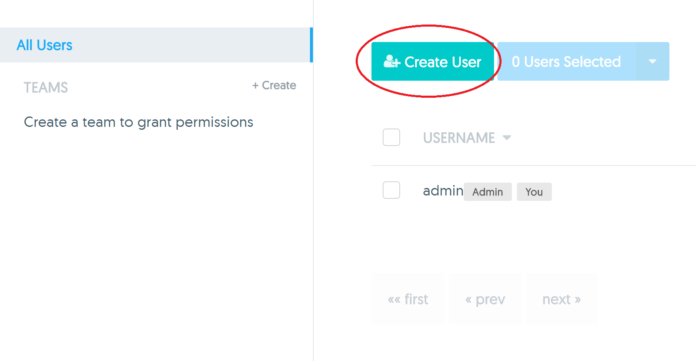
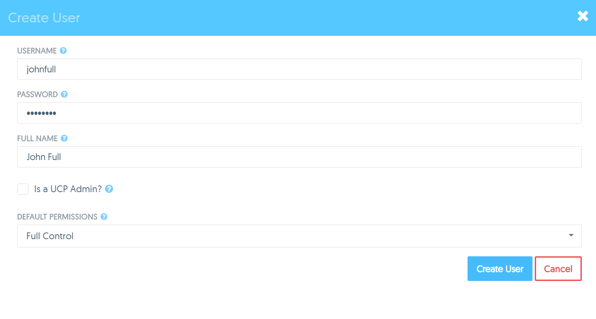
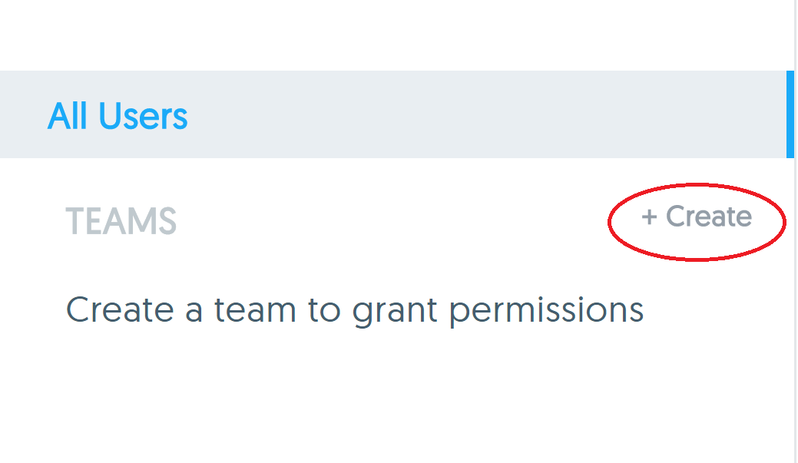
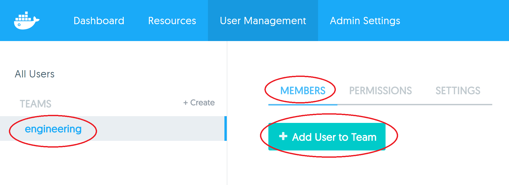
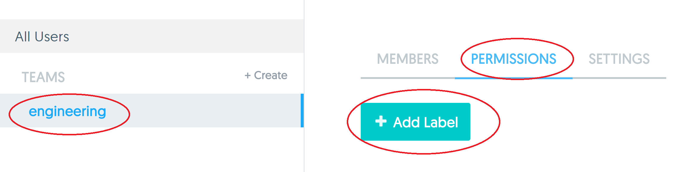
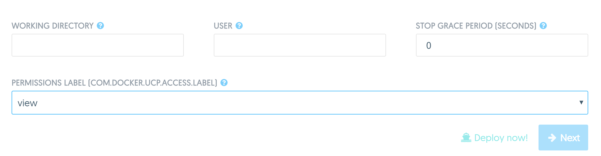

# Task 1 - Create Users and Teams

In this task you will complete the following four steps.

1. Create new users
2. Create a team and add users
3. Assign permissions to team
4. Deploy containers

## Pre-requisites

- A working UCP installation
- An UCP account with admin rights

## Step 1 - Create new users

In this step you will create the 4 new users shown below.

| Username   | Full Name         | Default Permissions |
| :--------- | :---------------- | :------------------ |
| johnfull   | John Full         | Full Control        |
| kerryres   | Kerry Restricted  | Restricted Control  |
| barryview  | Barry View        | View Only           |
| traceyno   | Tracey No         | No Access           |

1. Click **User Management** from the top navigation bar.

   

2. Click **Create User**.

   

3. Fill out the **Create User** form with the details provided in the table above. The screenshot below shows the form filled out with the details for the *John Full* user.

   

4. Click **Create User**.

> Be sure to make a note of the password that you set for each user. You will need this in future labs.

Repeat steps 1-4 for all users in the table above. Be sure to select the appropriate permissions from the **Default Permissions** dropdown.

>**Note:** The *Default Permissions* configured in the above step are not the same as the permissions you will set in Step 3. *Default Permissions* apply to non-labelled resources. The permissions you will set in Step 3 will only apply to resources that are labelled appropriately.

## Step 2 - Create a team and add users

Users can be grouped into teams for simpler management.

This step will walk you through the process of creating a team and adding users to the team.

1. Create a team called **engineering** by clicking the ** + Create** button shown in the image below.

  

2. Set the **TEAM NAME** to "engineering"

3. Make sure the engineering team is selected and click the **Add User to Team** button from the **Members** tab.

  

4. Add all four new users to the team by clicking the **Add to Team** button next to each of them and then click **Done**. Do not add yourself (usually "admin") to the team.

All four users are now members of the Engineering team.

## Step 3 Assign permissions to team

Labels are central to permissions in Docker UCP.

In this step you will create a new label and assign the Engineering team "View Only" access to that label. In Step 4 you will start a new container and apply that same label to the container. As a result, members of the Engineering team will have "View Only" access to the container.

1. With the **Engineering** team selected, go to the **Permissions** tab and click **+ Add Label**.

  

2. Create the following three labels and click **Add Label**.

| LABEL            |   PERMISSION         |
| :-------------   |   :------------------|
| view             |   View Only          |
| restricted       |   Restricted Control |
| run              |   Full Control       |

The labels will now be listed on the **Permissions** tab of the Engineering team.

## Step 4 - Deploy Services

In this step you will deploy a new Service using the NGINX image and use the "view" label. You will also deploy a service without any label.

1. Select **Resources** from the top navigation bar, and click **Create Service**.

2. Create a service using the following details:

   * **Service Name:** nginx
   * **Images:** nginx
   
   Scroll to the botton of the form, where you can see the **Permissions Label** field. Select the **View** label
   
   
   

Repeat the above steps to deploy another Service but this time, **Do note use any label**. Be sure to give each service a unique name.

In the next exercise you will explore the implications of running Services with labels.
   
   
   
   
   
   
   
   