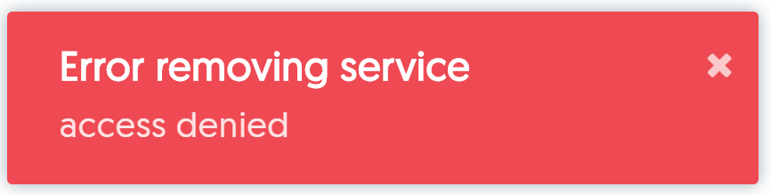
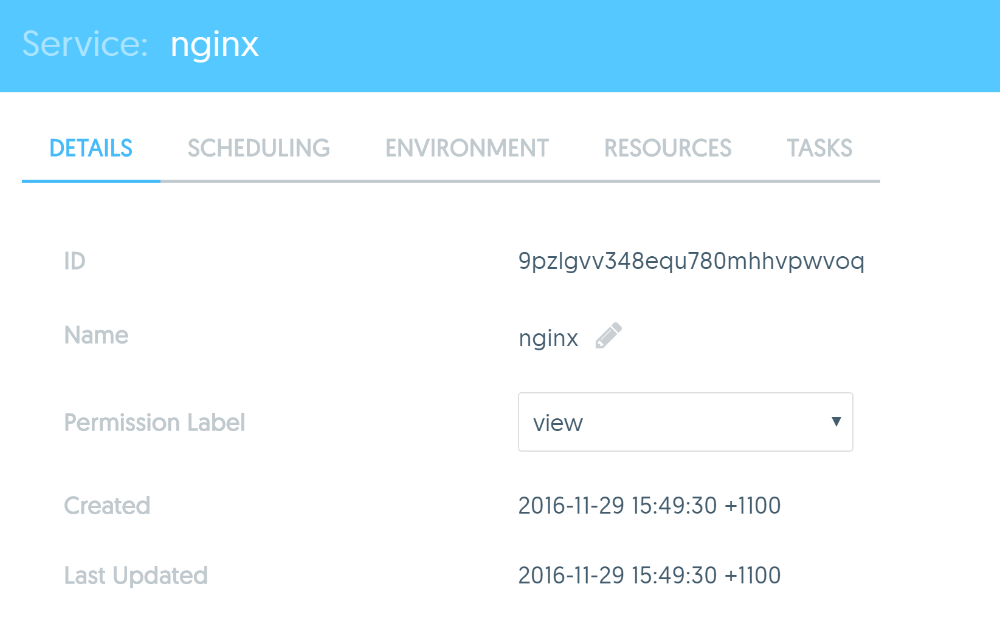
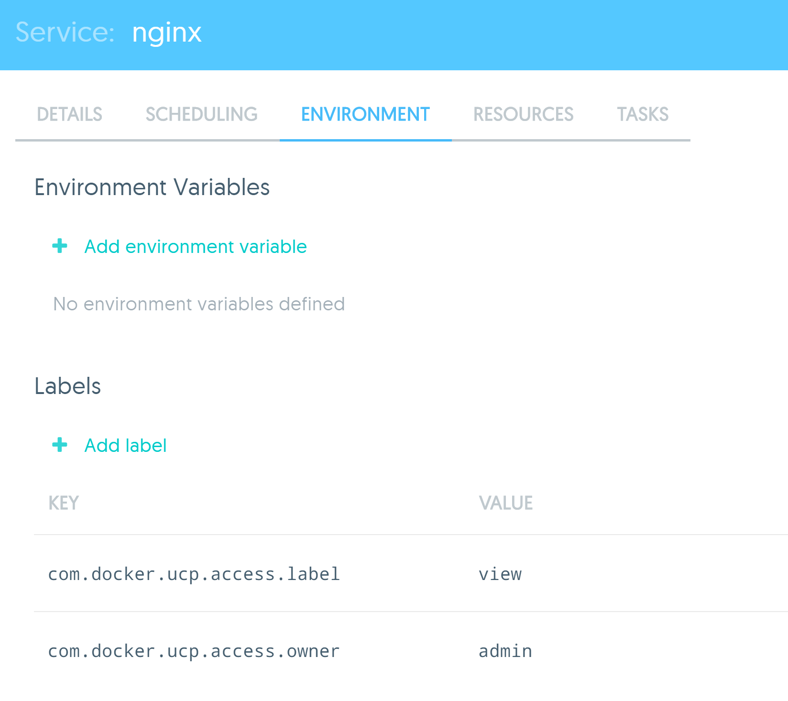
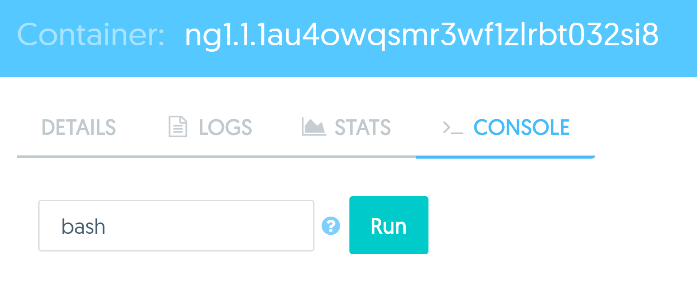
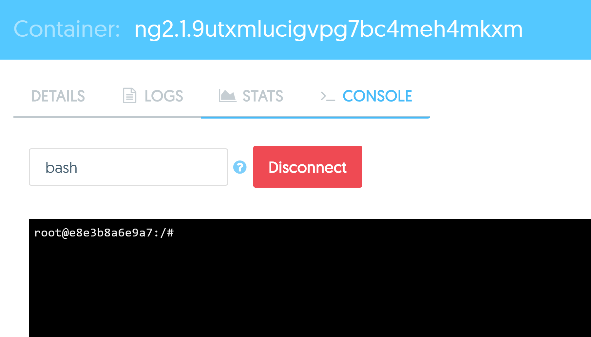
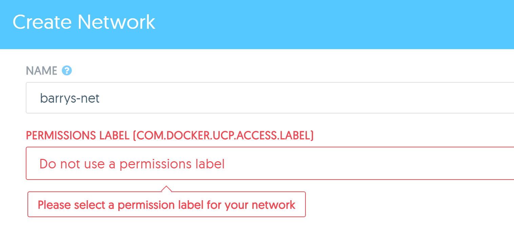

# Task 2 - Test User Access

In this task you will complete the following steps:
1. Test permission labels
2. Test container access from the web UI
3. Test container access from the command line
4. Test admin access form the command line
5. Test default permissions

## Pre-requisites

- Completed Task 1

## Step 1 - Test permission labels

Docker UCP uses labels to implement permissions and access control. In the previous lab (Task 1) you deployed the `nginx` Service with the "view" label. 
You also assigned the Engineering team "View Only" access to all resources tagged with the "view" label. In this step you will log back in to UCP as 
"johnfull" and verify that you only have view access to the `nginx` service.

1. Logout of UCP and log back in as user **johnfull**

2. Click on the **Resources** link in the top navigation bar.

  Confirm that you can only see the "nginx" Service (with the "view" label). The other Services that you deployed with no labels will not be visible.

3. Select the `nginx` Service and try to delete it.

  
  
  You should get the following error message on the botton of the screen
  
  

4. Click on the Service to view its details.

5. Notice the **view** permission label on the **Details** tab 

   
  
   You can also see this on the **Environment** tab. Look for the `com.docker.ucp.access.label` key in the **Labels** section
   
   
   
6. Click on the **Task** tab of the service and select the `nginx.1` task. This will bring up the container options. 

7. Click on the **Container Actions** button on the top right side and select the **Restart Container** option 

     
   
   Notice how you get the same **Access Denied** error message. The label permissions apply to the Service and also any containers that are part of the service.

7. Click the **Services** link in the left pane.

8. Deploy two additional Services using the details shown in the table below:

| Image Name | Service Name  | Permissions Label |
| :--------- | :---------------| :---------------- |
| nginx      | ng1             | restricted        |
| nginx      | ng2             | run               |

   While deploying the Services, you will notice that only the **Restricted** and **Run** permission labels are available for selection.

   This is because members of the Engineering team have 
   *Restricted Control* on the **restricted** label, and *Full Control* on the **run** label. 
   Both of these permissions allow for the deployment of new containers. Whereas with the **view** label, the Engineering team only has *View Only* permissions


## Step 2 - Test container access from the web UI

In this step you will attempt to perform certain actions while logged in as the **johnfull** user. Depending on which permissions labels are in force will determine whether these actions succeed or fail.

1. Click on the **ng1** Service. Then click the **Tasks** tab and select the `ng1.1` task. Then click on the **Console** tab.

  

2. Click on the **Run** button with "bash" specified in the field.

  This action is the GUI equivalent of running a `docker exec` command. In this case, you are trying to execute a `bash` terminal inside the **ng1** container.

  You will get an error message saying **Error attempting to open exec session**. 
  This is because the you are logged in as **johnfull** who is a member of the **Engineering** team, and the **Engineering** team only has 
  *Restricted Control* to the **ng1** Service containers via the **restricted** label. *Restricted Control* does not allow you to open exec sessions to a container.

4. Now try the same thing with the **ng2** container.

   This time the bash terminal will launch successfully. This is because the user **johnfull** is a member of the **Engineering** team which has *Full Control* 
   over the **ng2**  service containers via the **run** label.

  

## Step 3 - Test container access from the command line

In this step you will create and download a **client bundle** for the **johnfull** user, connect to UCP using the client bundle, 
and perform some tests from the command line. You can do this from either a Windows or Mac or you can upload the extracted client bundle folder 
into one of your AWS nodes and pretend that the node is your local machine.

1. Click the **johnfull** dropdown in the top right corner and select **Profile**.

2. Scroll to the bottom of the profile screen and click **Create a Client Bundle**.

   This will download the client bundle to your local machine as a zipped archive file.

3. Unzip the contents of the archive file and open a command prompt to the location of the extracted contents. 
   On a Windows machine this is likely to be C:\Users\your-user\Downloads\ucp-bundle-johnfull.

   The examples in this tutorial were created with the client bundle uploaded to the `ucp-controller` node running on AWS.

4. List the files in your current directory.

   **Note: **

   ```
   ubuntu@ucp-controller:~$ cd ucp-bundle-johnfull/
   ubuntu@ucp-controller:~/ucp-bundle-johnfull$ ls
   ca.pem  cert.pem  cert.pub  env.cmd  env.ps1  env.sh  key.pem
   ```

5. Execute the `env.sh` shell script.

   ```
   ubuntu@ucp-controller:~/ucp-bundle-johnfull$ source env.sh
   ```

6. Run a `docker ps` command to list the containers.

   The output should include 3 containers. One each from your `nginx`, `ng1` and `ng2` service.

   ```
   ubuntu@ucp-controller:~/ucp-bundle-johnfull$ docker ps
   CONTAINER ID        IMAGE               COMMAND                  CREATED             STATUS              PORTS               NAMES
   e8e3b8a6e9a7        nginx:latest        "nginx -g 'daemon off"   39 minutes ago      Up 39 minutes       80/tcp, 443/tcp     ucp-node-0/ng2.1.9utxmlucigvpg7bc4meh4mkxm
   fea9b7d18ba5        nginx:latest        "nginx -g 'daemon off"   39 minutes ago      Up 39 minutes       80/tcp, 443/tcp     ucp-node-1/ng1.1.1au4owqsmr3wf1zlrbt032si8
   7a178896af3c        nginx:latest        "nginx -g 'daemon off"   About an hour ago   Up About an hour    80/tcp, 443/tcp     ucp-node-0/nginx.1.2iyuafr5ag7it19kxdu5cruki
   ```

7. Look for the container with the name `ng1.1.<id>`. This is container 1 in our `ng1` service. Take note of the container ID and then run:
 
   `$ docker exec -it <container ID> bash` to open a `bash` terminal on the "ng1.1" container.
   
   ```
   ubuntu@ucp-controller:~/ucp-bundle-johnfull$ docker exec -it fea9b7d18ba5 bash
   Error response from daemon: access denied
   ```

   This will result in an *Error response from daemon: access denied* error. This is because the "ng1" Service is tagged with the "restricted" label, 
   which maps the *Restricted Control* permission to members of the Engineering team.

8. Repeat the same command for the **ng2.1** container.

   This time the command works because the **ng2** Service is tagged with the **run** label which maps the *Full Control* permission to 
   members of the Engineering team. Restricted Control does not allow users to `docker exec` into a container.


## Step 4 - Test admin access 

In this step you will attempt to launch a console form the UCP web UI, as well as the **admin** user's client bundle.

1. Logout of UCP as **johnfull** and log back in as the **admin** user

2. Click the **Resources** link in the top navigation bar of the web UI and click the **ng1** Service.

3. Click the **Task** tab and then select the **ng1.1** task.

4. Click the **Console** tab of the container task and run a **bash** terminal.

   This time the terminal opens. This is because the "admin" user has full access to all UCP resources, regardless of permissions labels that are applied.


## Step 5 - Test default permissions

In this step you will test access to UCP resources that are not tagged with permissions labels. The actions in this step wil be performed in the Docker UCP web UI.

1. Logout of UCP as the **admin** user and log back in as **johnfull**.

2. Click on the **Resources** link on the top navigation and the click the **Images** link on the left side bar.

3. Use the **Add Image** drop down and select the **Pull Image** option.

   

3. Pull the "hello-world" image.

  

  The image pull operation will be successful.

4. Click on the **Networks** link and click **+ Create Network** to create a new network called "johns-net".

   Just give the network a name and click **Create**.

   The network will be successfully created.

   From the previous 4 steps we can see that the user **johnfull** has full access to create networks, pull images, and perform other UCP tasks. This is because **johnfull** has the *Full Access* default permission, giving him full access to all non-tagged UCP resources. His access is only restricted to resources tagged with permissions labels.

5. Logout of UCP as **johnfull** and log back in as **kerryres**.

6. Click on the **Images** link and pull the "alpine" image.

7. Click on the **Networks** link and create a network called "kerry-net".

   Similar  to **johnfull**, **kerryres** can also pull images and create networks despite only having the **Restricted Control** default permission. However, there are actions that users with Full Control can do, that users with Restricted Control cannot do such as `docker exec` into containers and lauch **privileged** containers.

8. Logout of UCP as **kerryres** and log back in as **barryview**.

9. Click on the **Images** link.

   Notice that Barry does not even have a **Add Image** button. This is because **barryview** has the **View Only** default permission. This permission does not allow operations such as pulling images.

10. Click the **Networks** link and create a network called "barry-net".

    Notice it won't let you create the Network but will highlight the **Permissions Label** field as follows:
	
	
	
11. Select the **run** label on the **Permissions Label** field and then create the network. This time it should work.

    Barry is able to create a network using a team label as Team labels also apply access control to networks. Previously the users John and Kerry
    were able to create networks without using any label because their *Default Permission* was *Full Control* and *Restricted Control*, thereby granting them
    the ability to create networks outside of their team permissions. Barry, however only has *View Only* as his default permission. 	

12. Logout of UCP as **barryview** and login as **traceyno**.

12. Notice that Tracey cannot see the **Images** link. 

    This is because Tracey has the **No Access** default permission. 
	However, because Tracey is a members of the Engineering team, she gets access to all of the tagged resources that the Engineering team has access to.
	
	This includes the ability to create Networks using one of the team labels. 

13. Click the **Services** link and notice that Tracey can see the three services `nginx`, `ng1` and `ng2`

14. Create a network using either the **restricted** or **run** label. 
  
  


   
